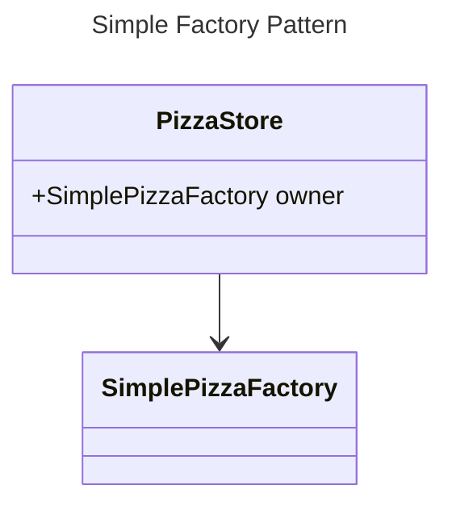

# FactoryPattern 
A factory pattern provides ways to instanciate classes without using new. 

## SimpleFactoryPattern

```mermaid
---
title: Simple Factory Pattern
---
classDiagram
    class PizzaStore
    PizzaStore : +SimplePizzaFactory owner
    PizzaStore --> SimplePizzaFactory

```

## FactoryMethodPattern
