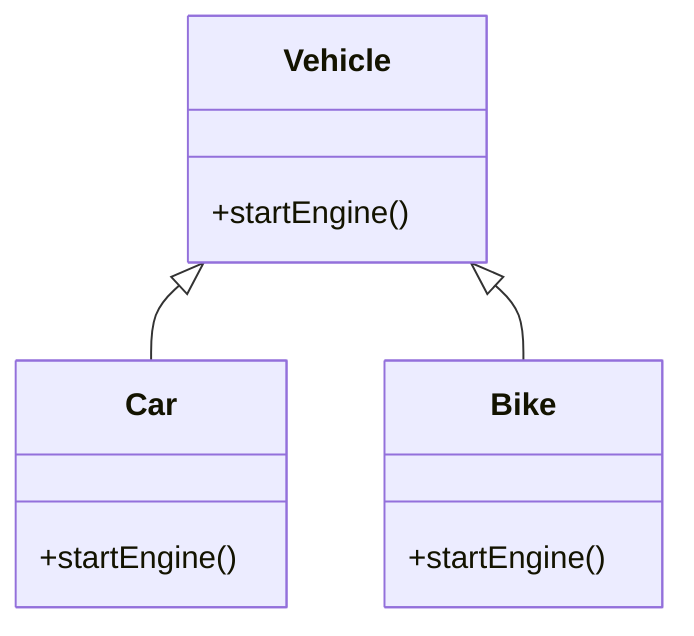

## SOLID
- Single Responsibility - Each class should have a single responsibility. 
- Open Close Principle - Class should be open for extension and close for modification. 
- Liskov Substitution Principle - Objects of super class can be replaced with objects of subsclass without breaking the system. 
- Interface Segregation Principle - Interfaces may not have a 
- Dependency Inversion Principle - High level modules like interfaces shouldn't depend on low level modules.

