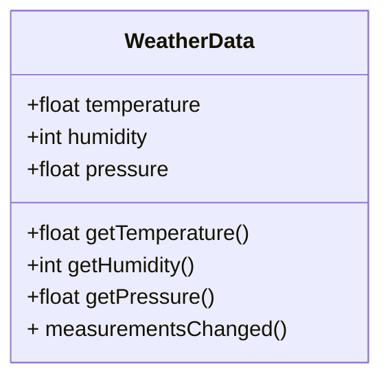
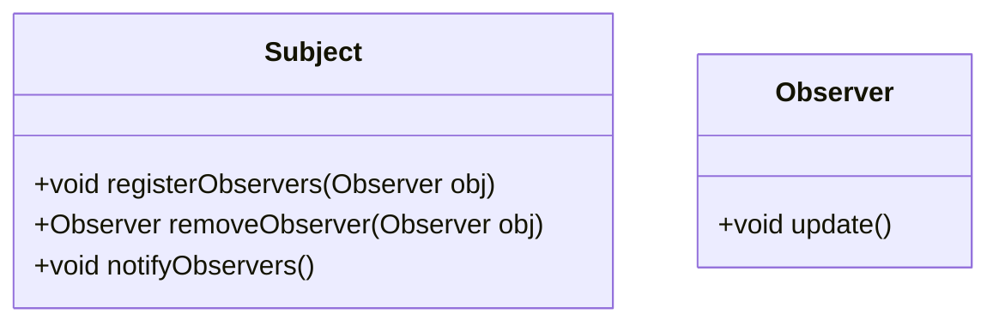

# Observer Pattern
Patterns that keeps the objects in the know is called as the observer pattern . 
## Main feature
Like one to many relationship and loose coupling.

## Question 

Build a weatherstation Monitoring system , you have to monitor Temprature , Humidity and Barometric pressure. 
You have to build three display elements , CurrentConditions, WetaherStatistics and SimpleForcast . All updated in realtime as weather dataobject acquires the most recent measurements. 

You have weatherData class


## ObserverPattern =  Publisher(Subjects) + Subscriber (Observer) 

Publisher Subscriber pattern is different as it is used in middleware systems. 



```java
    interface Subject {

        void registerObserver(Observer observer);
        void removeObserver(Observer observer);
        void notifyObservers();

    }

    interface Observer {
        void update()
    }
    
```


