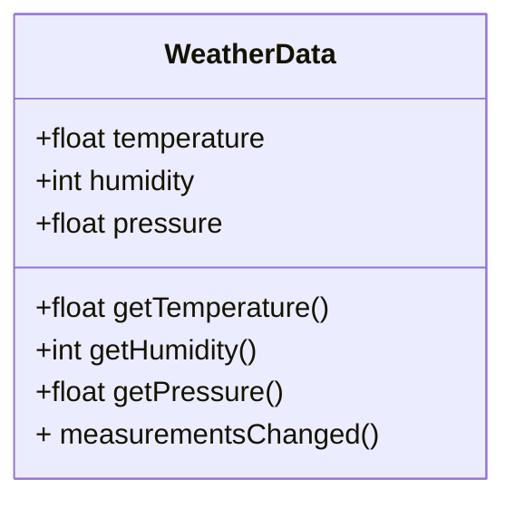
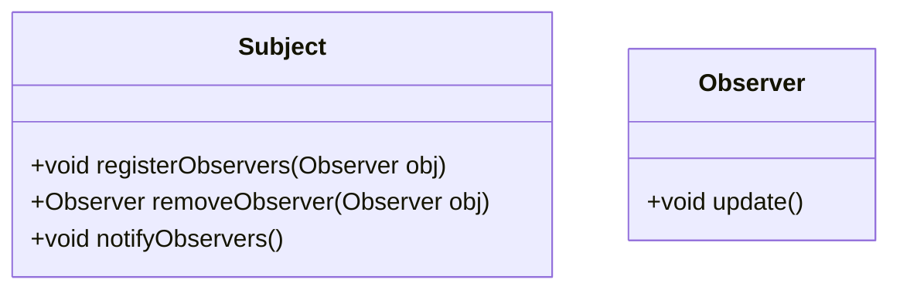

# Observer Pattern
Patterns that keeps the objects in the know is called as the observer pattern . 
## Main feature
Like one to many relationship and loose coupling.

## Question 

Build a weatherstation Monitoring system , you have to monitor Temprature , Humidity and Barometric pressure. 
You have to build three display elements , CurrentConditions, WetaherStatistics and SimpleForcast . All updated in realtime as weather dataobject acquires the most recent measurements. 

You have weatherData class


## ObserverPattern =  Publisher(Subjects) + Subscriber (Observer) 

Publisher Subscriber pattern is different as it is used in middleware systems. 



```java
    interface Subject {

        void registerObserver(Observer observer);
        void removeObserver(Observer observer);
        void notifyObservers();

    }

    interface Observer {
        void update();
    }
    
```
## Example WeatherORama 

```java
package com.sovan;

import java.math.BigDecimal;
import java.util.ArrayList;
import java.util.List;

public class WatherORamaApplication {

    static interface Subject{

        void addObserver(Observer o);
        void removeObserver(Observer o);
        void notifyObservers();


    }
    static interface Observer{

        void update(Subject s);
    }


    public static void main(String[] args) {

        WeatherStation weatherStation = new WeatherStation();
        weatherStation.addObserver(new WatherORamaApplication.CurrentConditions());
        weatherStation.addObserver(new WatherORamaApplication.AvergaeConditons());
        weatherStation.setHumidity(BigDecimal.valueOf(22.5));
        weatherStation.setPressure(BigDecimal.valueOf(45.0));
        weatherStation.setTemprature(BigDecimal.valueOf(30.0));
        weatherStation.notifyObservers();
    }


    static class WeatherStation implements Subject{

        BigDecimal temprature;
        BigDecimal pressure;
        BigDecimal humidity;

        List<Observer> observerList = new ArrayList<>();

        public BigDecimal getHumidity() {
            return humidity;
        }
        public void setHumidity(BigDecimal humidity) {
            this.humidity = humidity;
        }
        public BigDecimal getPressure() {
             return pressure;
        }
        public void setPressure(BigDecimal pressure) {
            this.pressure = pressure;
        }
        public BigDecimal getTemprature() {
            return temprature;
        }

        public void setTemprature(BigDecimal temprature) {
            this.temprature = temprature;
        }

        @Override
        public void addObserver(Observer o) {
            observerList.add(o);
        }

        @Override
        public void removeObserver(Observer o) {
            observerList.remove(o);
        }

        @Override
        public void notifyObservers() {
            for(Observer o : observerList){
                o.update(this);
            }
        }
    }


    static class CurrentConditions implements Observer{

        WeatherStation weatherStation;

        @Override
        public void update(Subject s) {
            WeatherStation weatherStation = (WeatherStation) s;
            this.weatherStation = weatherStation;
            displayCurrentCondition();
        }

        private void displayCurrentCondition(){
            System.out.println("Current Conditions Humidity: " + weatherStation.getHumidity()+ "Current Conditions Pressure: " + weatherStation.getPressure() + " Current Conditions Temperature: " + weatherStation.getTemprature());
        }

    }


    static class AvergaeConditons implements Observer{
        WeatherStation weatherStation;

        BigDecimal abgTemperature = BigDecimal.ZERO;
        BigDecimal abgHumidity  = BigDecimal.ZERO;
        BigDecimal abgPressure = BigDecimal.ZERO;

        int numberConditions = 1;


        @Override
        public void update(Subject s) {

            WeatherStation weatherStation = (WeatherStation) s;
            this.weatherStation = weatherStation;
            displayAverageCondition();

        }

        private void displayAverageCondition(){
            abgHumidity = abgHumidity.multiply(BigDecimal.valueOf(numberConditions)).add(weatherStation.getHumidity()).divide(BigDecimal.valueOf(numberConditions+1));
            abgTemperature = abgTemperature.multiply(BigDecimal.valueOf(numberConditions)).add(weatherStation.getTemprature()).divide(BigDecimal.valueOf(numberConditions+1));
            abgPressure = abgPressure.multiply(BigDecimal.valueOf(numberConditions)).add(weatherStation.getPressure()).divide(BigDecimal.valueOf(numberConditions+1));
            numberConditions++;

            System.out.println("Average Conditions Humidity: " + abgHumidity+ "Average Conditions Pressure: " +  abgPressure + " Average Conditions Temperature: " + abgTemperature);


        }
    }

}
```


